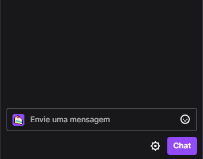

# Botijela Documentation
This repository serves as documentation for Botijela

## Botijela
 [BotiJela](https://www.twitch.tv/botijela) is a twitch bot made by [Brejelinha](https://www.twitch.tv/brejelinha), made for message translation and viewer queue management.
***
 [Botijela](https://www.twitch.tv/botijela) é um bot da twitch, desenvolvido por [Brejelinha](https://www.twitch.tv/brejelinha), feito para traduzir mensagens e gerenciar filas de espectadores.

## How to enable it?
To add Botijela at your channel you must:
1. Go to [Botijela's Channel](https://www.twitch.tv/botijela)
1. Type $join in chat

